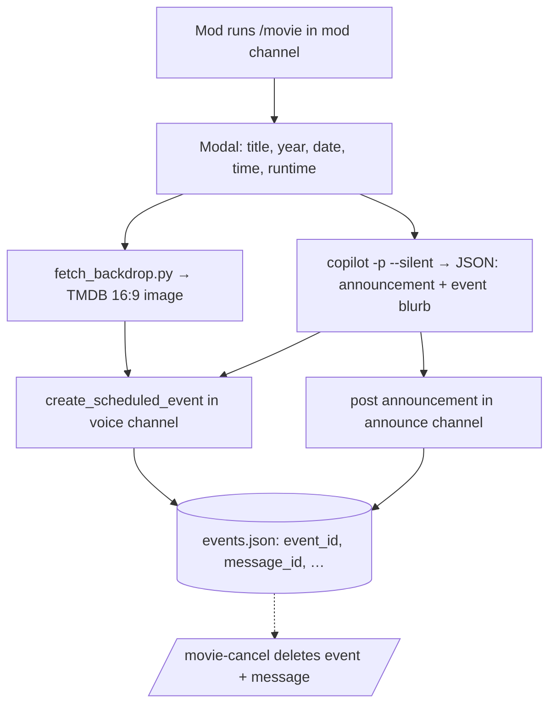
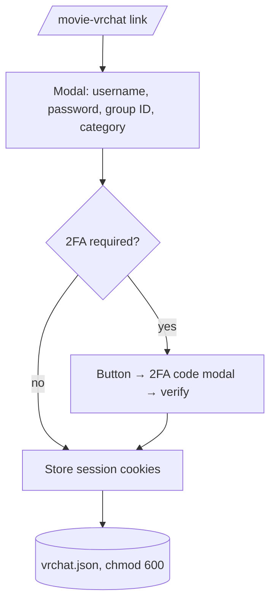

# 🎬 Movie Night Bot

A focused, **least-privilege** Discord bot that lets server mods schedule movie
nights. For each one it creates a native Discord **scheduled event** in the
guild's movie voice channel and posts a whimsical **announcement** in the
guild's announcements channel — both enriched with AI-generated content
(synopsis, cast, director, fun facts).

No `Administrator`. No privileged intents. Each server's mods configure their
own channels, ping role and timezone.

---

## Features

- **`/movie`** — opens a form (title / year / date / time / runtime), then:
  - creates a Discord scheduled event (with a 16:9 backdrop image when found), and
  - posts a styled announcement, optionally pinging a configurable role.
- **`/movie-test`** — dry-run that verifies config and all required permissions
  (Manage Events, channel visibility, send/embed/attach, ping role) **without**
  posting anything. Run this before the first real `/movie`.
- **`/movie-cancel`** — autocompletes this server's upcoming movie nights and
  deletes **both** the scheduled event and the announcement message.
- **`/movie-help`** — posts an ephemeral guide listing every command and what it does.
- **`/movie-config set | show | clear`** — per-guild configuration.
- **AI content** via the [GitHub Copilot CLI](https://github.com/github/copilot-cli):
  the bot shells out to `copilot -p ... --silent` to write the announcement and
  a synopsis + fun facts for the event. Falls back to a plain template if
  Copilot isn't available (toggle with `use_copilot` in `config.json`).
- **VRChat group calendar (optional):** if a server links a VRChat group, each
  movie night also creates a **VRChat group calendar event**, and `/movie-cancel`
  removes it too. See [VRChat integration](#vrchat-integration-optional).

---

## How it works



Per-guild state lives in JSON files next to `bot.py`:

| File | Purpose | Committed? |
| --- | --- | --- |
| `token` | bot token (or use `MOVIE_BOT_TOKEN`) | no (gitignored) |
| `config.json` | global defaults | no |
| `guilds.json` | per-guild channel/role/tz config | no |
| `events.json` | scheduled events the bot created (for cancel) | no |
| `vrchat.json` | per-guild VRChat session cookies + linked group | no (chmod 600) |
| `bot.log` | runtime log | no |

---

## Required Discord setup

### Permissions (integer `17600777079808` — **not** Administrator)

| Permission | Why |
| --- | --- |
| View Channels | see configured channels |
| Send Messages | post announcements |
| Embed Links | render link previews |
| Attach Files | attach the backdrop image |
| Connect | required to schedule a **voice-channel** event |
| Create Events | create scheduled events |
| Manage Events | edit/delete scheduled events |

> **Note:** Discord split event permissions into **Create Events** (to create)
> and **Manage Events** (to edit/delete any). Creating a scheduled event needs
> **Create Events** — an invite with only Manage Events will fail with a
> `Forbidden` error. For a *voice* event the bot also needs **View Channel** and
> **Connect** on the target voice channel.

### Invite scopes

`bot` + `applications.commands`

### Invite URL

```
https://discord.com/api/oauth2/authorize?client_id=YOUR_APP_ID&scope=bot+applications.commands&permissions=17600777079808
```

Gateway intents: **guilds only** (no Message Content / Members / Presence).

---

## Install

Requires **Python 3.11+** (uses `zoneinfo`) and, for AI content, the
**GitHub Copilot CLI** on the host.

```bash
git clone https://github.com/M1XZG/movie-night-bot.git
cd movie-night-bot

python3 -m venv .venv
.venv/bin/pip install -r requirements.txt

cp config.example.json config.json        # edit if you like
echo "YOUR_BOT_TOKEN" > token && chmod 600 token   # or export MOVIE_BOT_TOKEN

.venv/bin/python bot.py
```

### Run as a systemd user service

```bash
cp movie-night-bot.service ~/.config/systemd/user/
# edit paths inside the unit if your clone isn't at ~/movie-night-bot
systemctl --user daemon-reload
systemctl --user enable --now movie-night-bot
journalctl --user -u movie-night-bot -f
```

> **AI content gotcha:** the bot calls the `copilot` CLI as a subprocess. Under
> systemd's minimal `PATH`, an old system `node` can be picked up and break the
> Copilot loader (`SyntaxError: Unexpected token '?'`). The bot mitigates this
> by prepending the `copilot` binary's own `bin/` dir to the subprocess `PATH`.
> If you still see template-only posts, set an explicit `Environment=PATH=...`
> in the unit (see the commented line in `movie-night-bot.service`).

---

## Configure a server (per guild)

A mod with **Manage Events** runs, in the channel that should become the mod
channel:

```
/movie-config set mod_channel:#mods announce_channel:#announcements voice_channel:🔊 Movie Night ping_role:@Movie Pings timezone:Europe/London
```

Then check it:

```
/movie-config show
```

To create the Discord event (and VRChat event) **without** posting an
announcement — e.g. an events-only server — turn announcements off:

```
/movie-config set announcements:False
```

Set `announcements:True` to turn posting back on. The announcements channel is
still required either way, so it's ready when you re-enable it.

Now schedule one (must be run in the configured mod channel):

```
/movie
```

…and cancel if needed:

```
/movie-cancel   # pick from the autocomplete list
```

### Config options

| Option | Notes |
| --- | --- |
| `mod_channel` | only channel where `/movie` and `/movie-cancel` work |
| `announce_channel` | where announcements are posted |
| `voice_channel` | the scheduled event's voice channel |
| `ping_role` | optional role to ping at the top (use `@everyone` for everyone) |
| `timezone` | IANA tz name, e.g. `America/New_York` (default from `config.json`) |

`config.json` global defaults:

| Key | Default | Meaning |
| --- | --- | --- |
| `default_timezone` | `Europe/London` | fallback tz |
| `use_copilot` | `true` | enable AI content via the Copilot CLI |
| `copilot_timeout` | `120` | seconds to wait for Copilot |
| `default_runtime_minutes` | `120` | event length when runtime omitted |

---

## Security notes

- Slash commands are gated with `default_permissions(manage_events=True)` and
  `guild_only()`; `/movie` and `/movie-cancel` are additionally restricted to
  the configured mod channel.
- The bot requests **no privileged intents** and uses `Intents.none()` +
  `guilds`. It never reads message content.
- Secrets (`token`) and per-instance state are gitignored. Use
  `MOVIE_BOT_TOKEN` to keep the token out of the filesystem entirely.

---

## VRChat integration (optional)

If a server runs movie nights inside a VRChat **group**, the bot can also create
a matching event on that group's **calendar** — and remove it when you cancel.

### How linking works

VRChat has **no OAuth**, so the only way to get a session is username + password
+ 2FA. Linking is therefore a one-time, self-service flow per server:

1. A mod runs **`/movie-vrchat link`**.
2. A modal asks for the VRChat **username**, **password**, **group ID**
   (`grp_…`) and an optional event **category** (default `film_media`).
3. If the account has 2FA, the bot replies with an *Enter 2FA code* button →
   another modal collects the email/authenticator code.
4. The bot verifies and stores **only the resulting session cookies** (in
   `vrchat.json`, `chmod 600`) — **never the password**.



### Commands

| Command | What it does |
| --- | --- |
| `/movie-vrchat link` | start the credential + 2FA flow (one-time per server) |
| `/movie-vrchat status` | show the linked account/group and check if the session is still valid |
| `/movie-vrchat unlink` | delete the stored session and group link |

Once linked, every `/movie` also creates a VRChat group calendar event
(`POST /calendar/{groupId}/event`) using the movie's title, AI synopsis, and
start/end times; `/movie-cancel` deletes it (`DELETE /calendar/{groupId}/{calendarId}`).

**Event image.** The movie backdrop is converted to a PNG and uploaded to the
**linked account** (`POST /file/image`, tag `gallery`), and the returned
`file_…` id is set as the event's `imageId` — so the VRChat event shows the
movie image instead of the group's banner. When the event is cancelled, the
uploaded image is also deleted from the linked account
(`DELETE /file/{fileId}`). Image handling is best-effort: if Pillow is missing,
the upload fails, or no backdrop is found, the event simply falls back to the
group banner. (Requires `Pillow` — see `requirements.txt`.)

### Requirements & caveats

- The linked VRChat account must be a **member of the group with permission to
  manage calendar events**.
- Uploaded event images are owned by the **linked user account** (they appear in
  that account's gallery/files) and are removed on `/movie-cancel`.
- The VRChat API is **unofficial**. The bot sends a descriptive `User-Agent`
  and makes only occasional calls; respect VRChat's rate limits and Terms.
- Session cookies expire eventually — when they do, `/movie` and
  `/movie-vrchat status` will say so; just run `/movie-vrchat link` again.
- Discord modals don't mask the password field as you type, and the value
  transits Discord's interaction payload to the bot. Only link an account you
  control, on a bot host you trust. The bot stores **only** the session token.

---

## License

[MIT](LICENSE)
